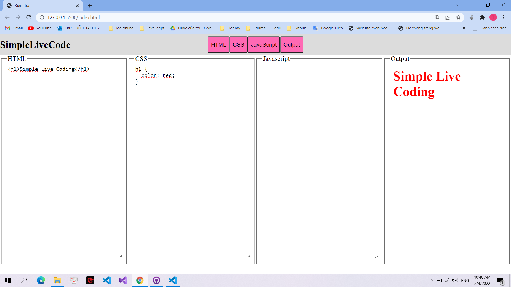
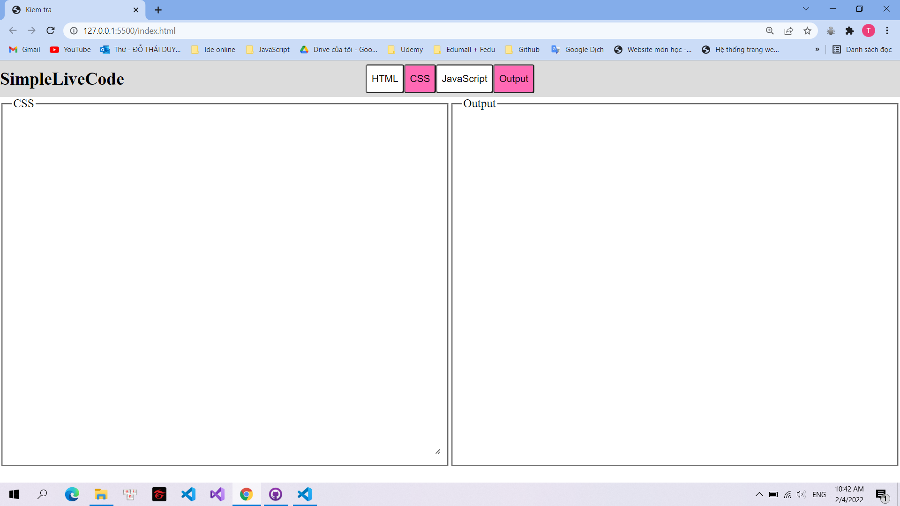

# Simple-Live-Coding

Test number 2 of Web class 19_3. This test help us to create a simple live coding with a simple user interface.

### Thông tin sinh viên thực hiện:
|       Họ và tên      |   MSSV   | Email                           |
|----------------------|:--------:|---------------------------------|
| Đỗ Thái Duy    | 19120492 | thaiduydo17@gmail.com            |
### Các chức năng đã làm được:

**1. Tạo giao diện và thực hiện các chức năng trên các phần tương ứng:**

**2. Ẩn các phần tương ứng và kích thước các phần chưa được ẩn phải hợp lý**

### Mức độ hoàn thành: 100%
